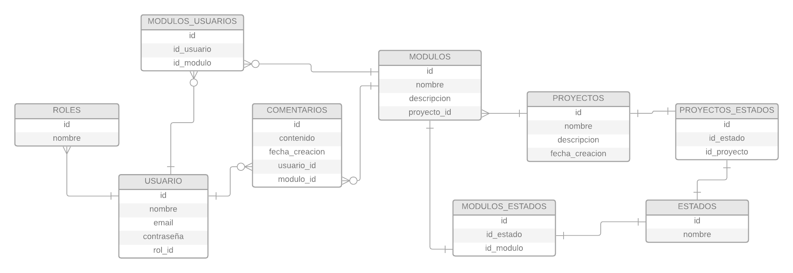

# Synthia

## OBJETIVOS GENERALES

- El objetivo general de este proyecto es desarrollar una plataforma de gestión de proyectos que permita la creación de módulos, asignación de desarrolladores y seguimiento del progreso, con el fin de facilitar la administración y ejecución eficiente de proyectos.

| **OBJETIVOS ESPECÍFICOS**                                                                                                                                                                     |
| --------------------------------------------------------------------------------------------------------------------------------------------------------------------------------------------- |
| Permitir la creación de usuarios en la plataforma, con la capacidad de acceder y participar en proyectos.                                                                                     |
| Asignar roles a los usuarios para establecer sus responsabilidades y permisos dentro de los proyectos.                                                                                        |
| Proporcionar a los administradores la capacidad de crear, editar y eliminar proyectos según sea necesario.                                                                                    |
| Permitir la creación de módulos dentro de los proyectos, para organizar y estructurar las tareas específicas.                                                                                 |
| Facilitar la asignación de uno o varios usuarios a cada módulo, para definir claramente quiénes son los responsables de su desarrollo.                                                        |
| Permitir a los usuarios marcar el estado de los módulos como "En desarrollo" o "Finalizado" para mantener un seguimiento actualizado del progreso.                                            |
| Brindar a los administradores la capacidad de marcar el estado de un proyecto completo como "En desarrollo" o "Finalizado", lo que indica su estado general.                                  |
| Ofrecer a los administradores la posibilidad de agregar comentarios de feedback a los módulos de un proyecto, para proporcionar retroalimentación y mejorar la calidad del trabajo realizado. |

## DIAGRAMA DE RELACIONES EN LA BASE DE DATOS

## LENGUAJES Y HERRAMIENTAS UTILIZADOS

    

## AUTORES

- [@Jean0405](https://github.com/Jean0405)

## COLABORADOR

**latinoamericacampus233@gmail.com**
